# Data Visualization Laboratory Virtual Record

Academic Year: 2026-2027

This virtual record follows the ten exercises in the laboratory manual. Each experiment has its own folder containing `theory.md` and a practical/program file.

## Experiments

1. [Introduction to Data Visualization Tools](01-introduction-tools/)
2. [Basic Visualization in Python](02-python-visualization/)
3. [Basic Visualization in R](03-r-visualization/)
4. [Introduction to Tableau and Installation](04-tableau-installation/)
5. [Connecting to Data and Preparing Data](05-data-preparation/)
6. [Data Aggregation and Statistical Functions](06-aggregation-statistics/)
7. [Creating Scatter Plot Maps](07-scatter-plot-maps/)
8. [Charts, Graphs, and Data Mapping](08-tableau-charts-maps/)
9. [Basic Dashboards](09-dashboards/)
10. [Storytelling in Tableau](10-storytelling/)

## Setup

```bash
python3 -m pip install -r requirements.txt
```

Python programs save figures in their experiment folder under `outputs/`. Tableau experiments document the GUI workflow and use only non-confidential sample data.

## Generated Graphs

The following previews are generated by the programs in this record.

### Basic Python Visualizations

| Line chart | Bar chart |
| --- | --- |
| 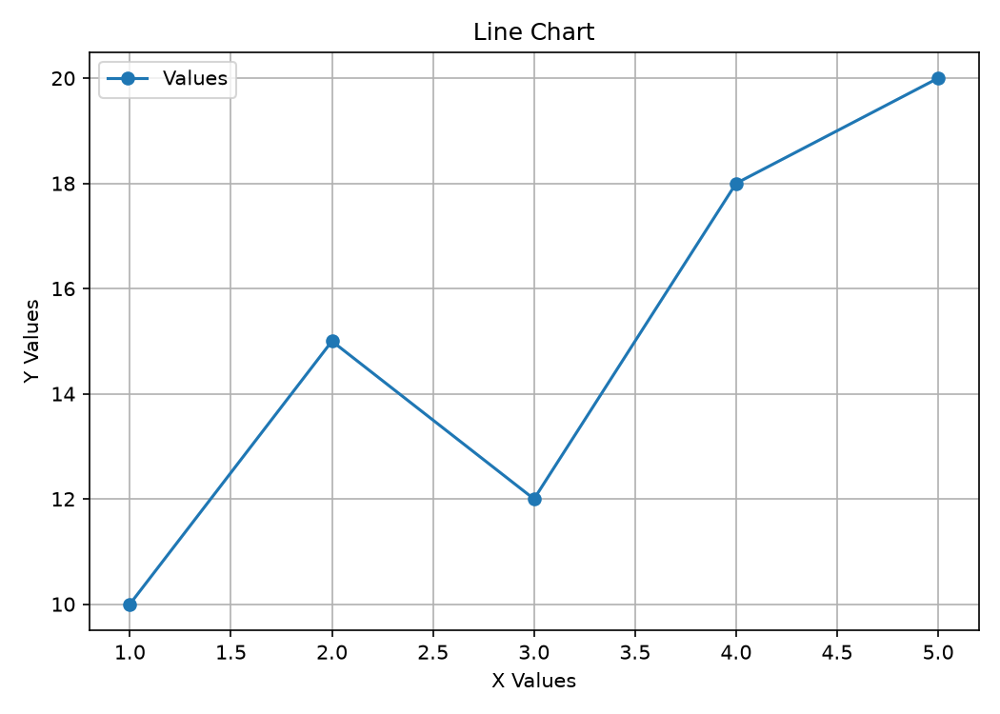 | 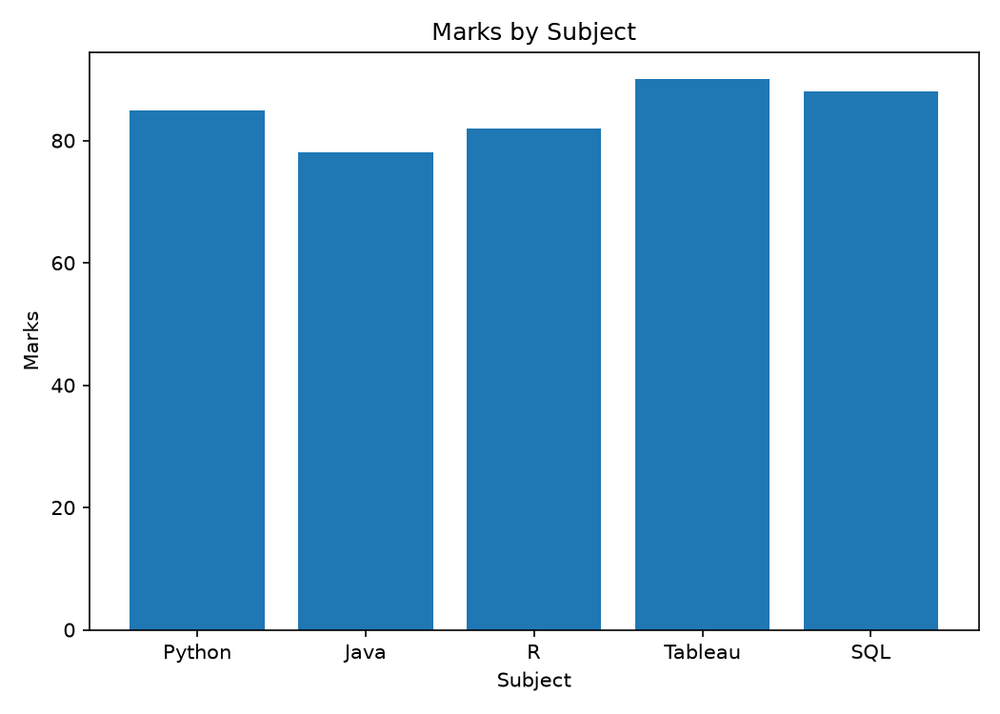 |

| Pie chart | Scatter plot |
| --- | --- |
| 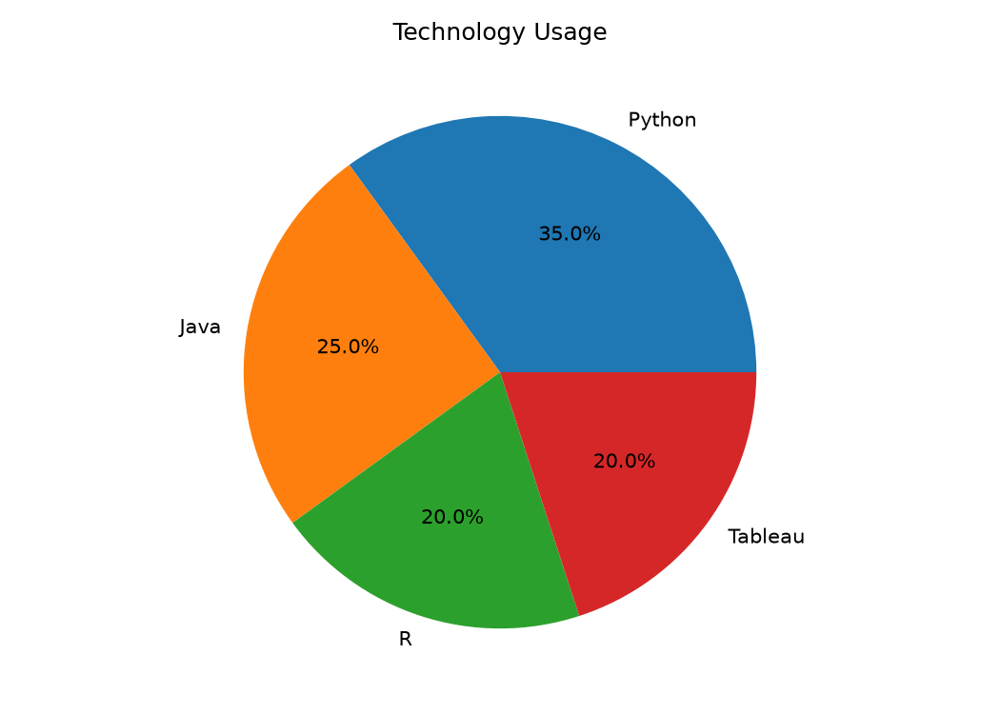 | 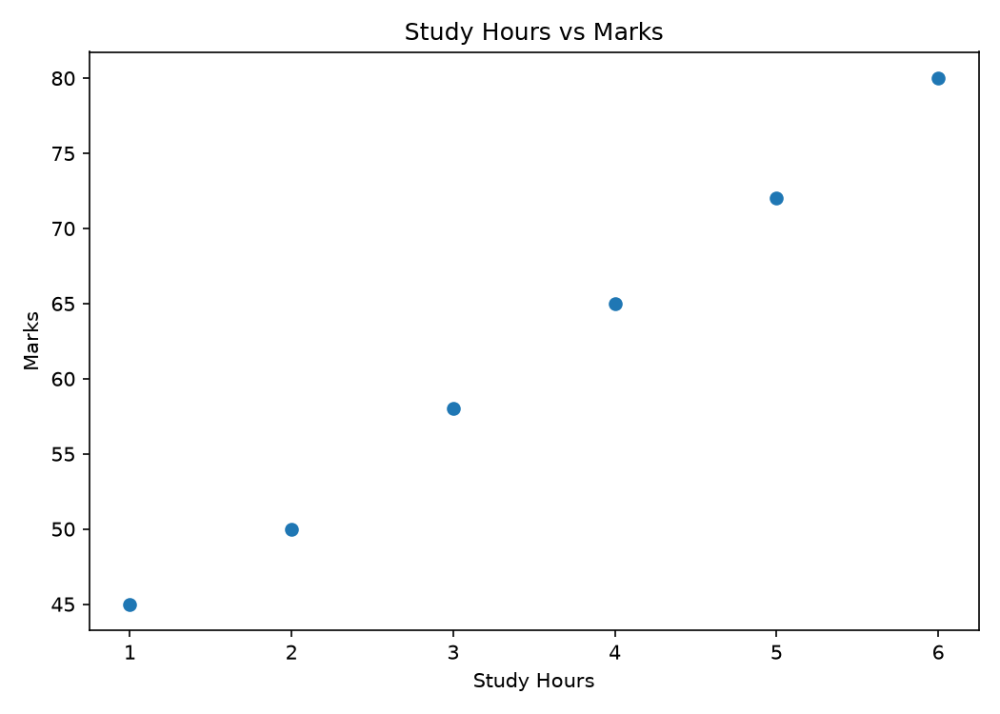 |

| Histogram |
| --- |
| 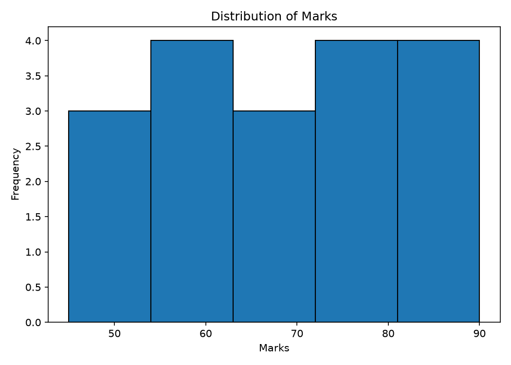 |

### Tableau Companion Visualizations

| Sales by category | Sales by region |
| --- | --- |
| 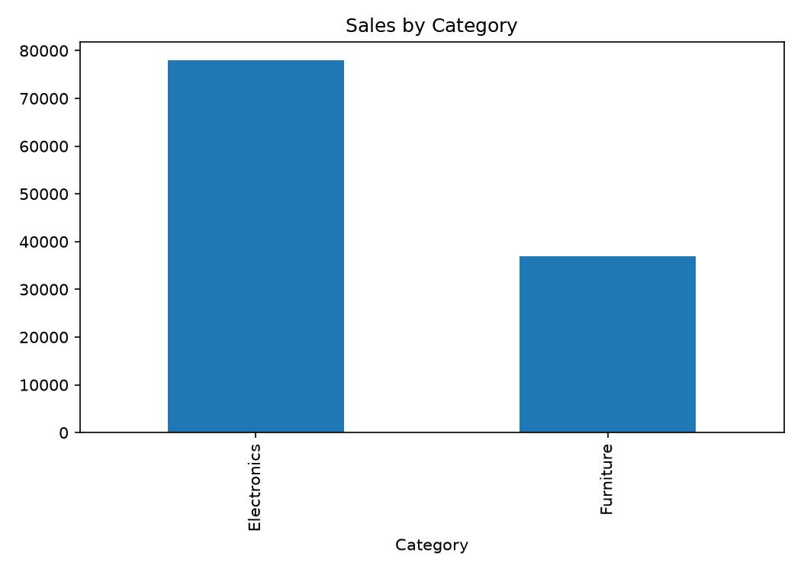 |  |

| Sales versus quantity | Regional scatter plot |
| --- | --- |
| 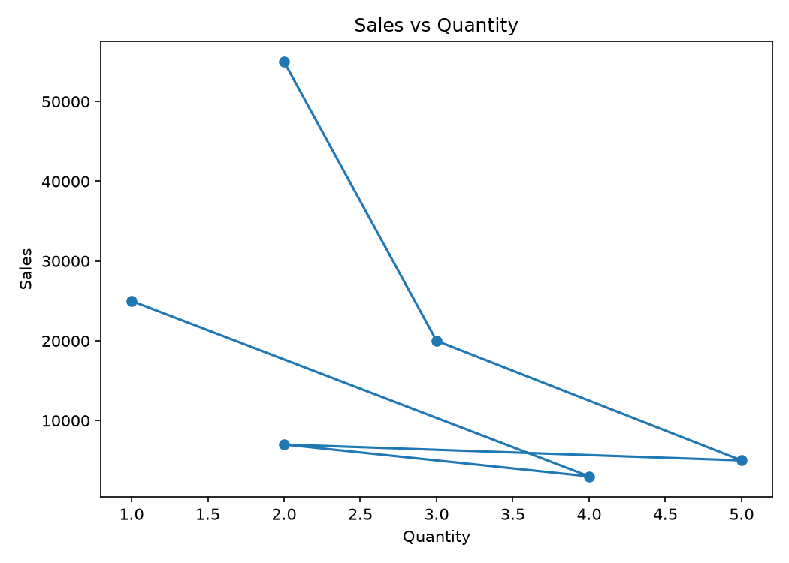 | 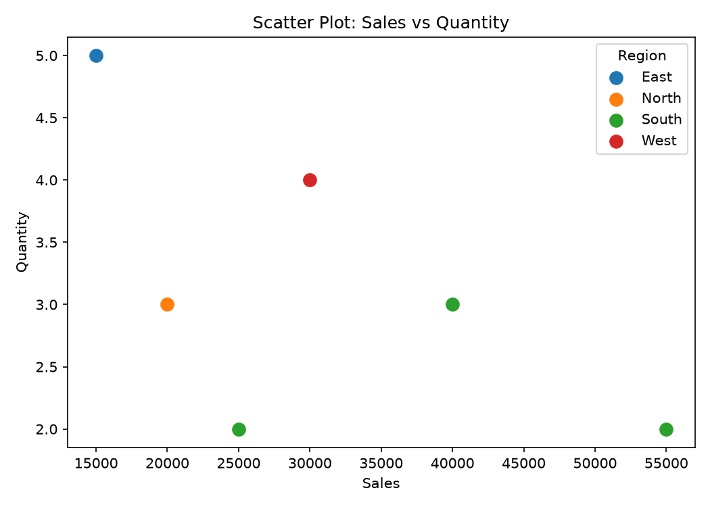 |

### Dashboard and Storytelling

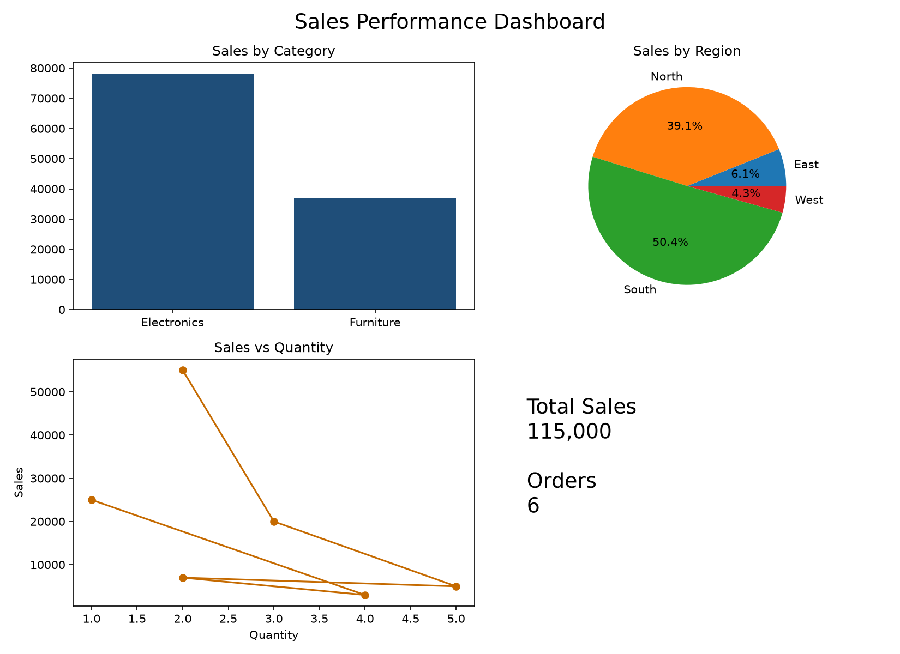

| Story 1: Category performance | Story 2: Regional contribution |
| --- | --- |
| 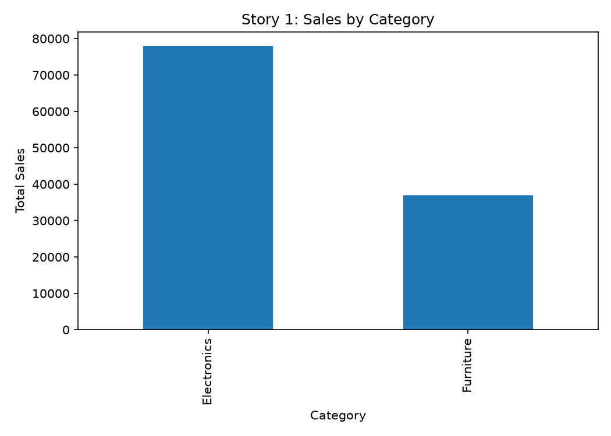 | 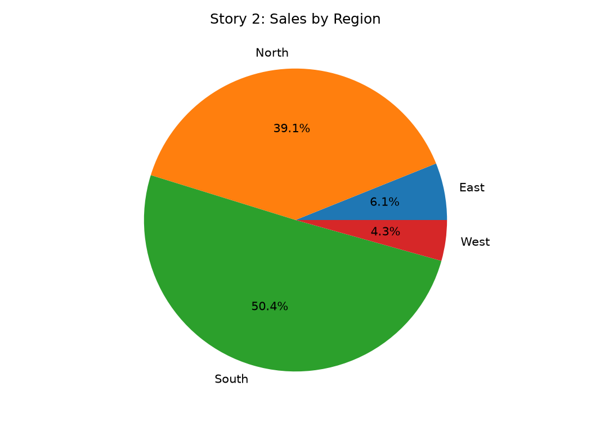 |

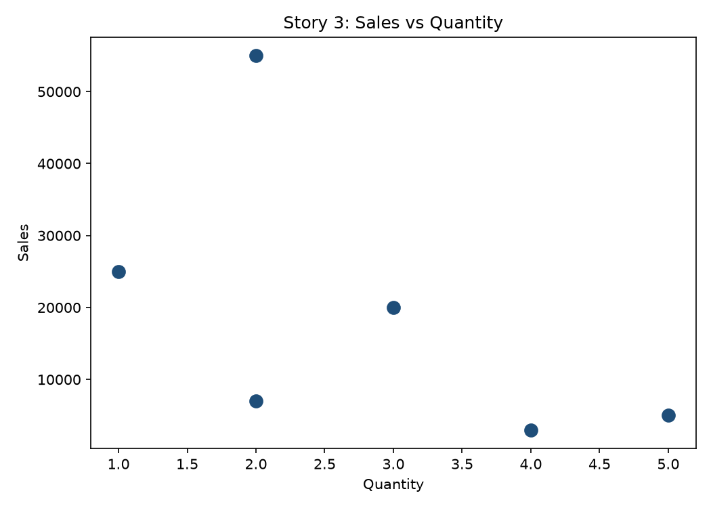

To regenerate the images after editing a program:

```bash
for file in DV_LAB/*/program.py; do python3 "$file"; done
```
