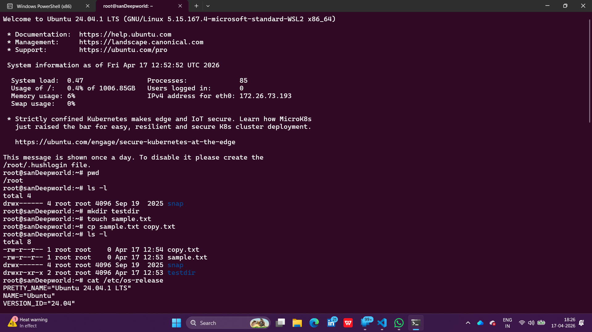
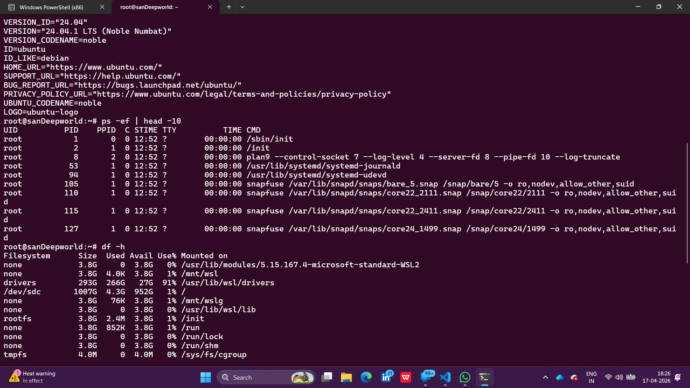
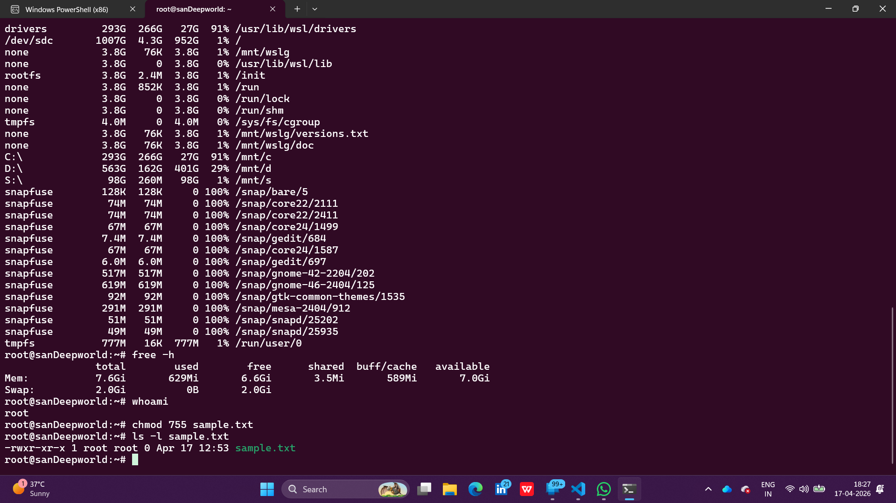
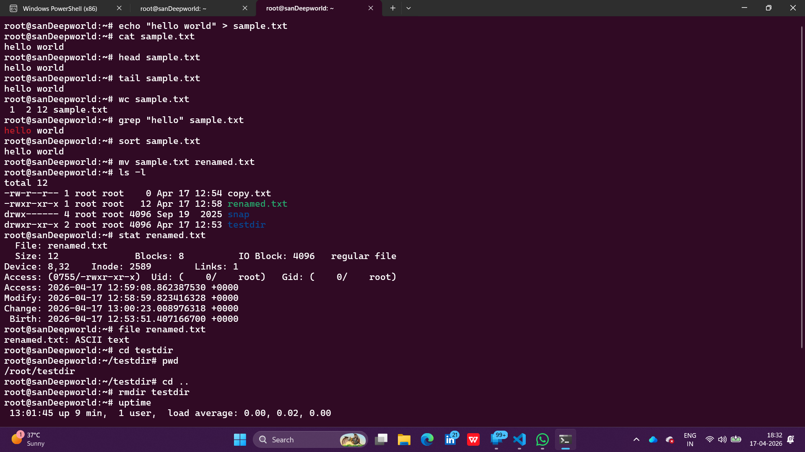
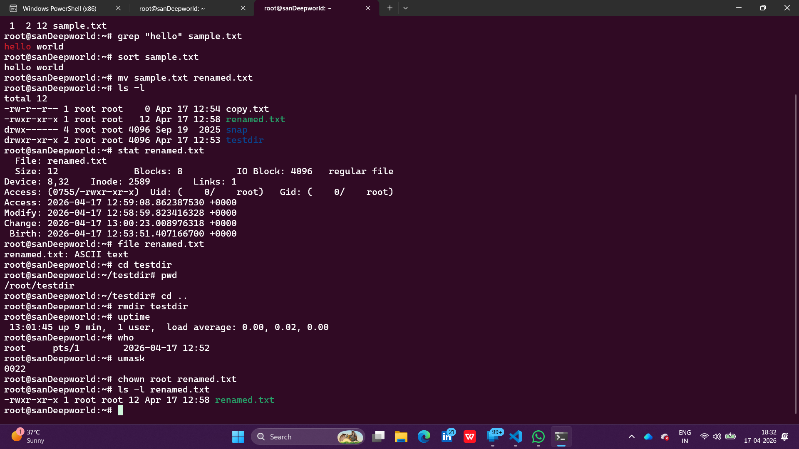

> **Name:** Sandeep Kumar Bollavaram | **Reg No:** 11249A040 | **Email:** 11249A040@kanchiuniv.ac.in

---

# Ex No: 2 — Basic Linux Commands

## Aim
To understand and practice basic Linux commands used for file/directory management,
process monitoring, text file operations, and file permission handling.

---

## a) File and Directory Commands

| Command | Description | Example |
|---------|-------------|---------|
| `pwd` | Print working directory | `pwd` |
| `ls` | List files | `ls -l`, `ls -a` |
| `cd` | Change directory | `cd Documents` |
| `mkdir` | Create directory | `mkdir oslab` |
| `mkdir -p` | Create nested directories | `mkdir -p cse/os/lab` |
| `rmdir` | Remove empty directory | `rmdir oslab` |
| `touch` | Create empty file | `touch file.txt` |
| `cp` | Copy files/directories | `cp file1.txt file2.txt` |
| `mv` | Move or rename | `mv old.txt new.txt` |
| `rm` | Remove files | `rm file.txt`, `rm -r folder` |
| `file` | Identify file type | `file file.txt` |
| `stat` | Display file details | `stat file.txt` |

---

## b) Process and Status Commands

| Command | Description | Example |
|---------|-------------|---------|
| `ps` | Show running processes | `ps -ef` |
| `top` | Real-time process viewer | `top` |
| `htop` | Interactive process viewer | `htop` |
| `kill` | Kill process by PID | `kill 1234` |
| `pkill` | Kill process by name | `pkill firefox` |
| `jobs` | Show background jobs | `jobs` |
| `fg` / `bg` | Foreground/background | `fg`, `bg` |
| `uptime` | System uptime | `uptime` |
| `who` | Logged-in users | `who` |
| `whoami` | Current user | `whoami` |
| `free` | Memory usage | `free -h` |
| `df` | Disk space | `df -h` |
| `du` | Directory size | `du -sh folder` |

---

## c) Text Commands

| Command | Description | Example |
|---------|-------------|---------|
| `cat` | Display file contents | `cat file.txt` |
| `tac` | Reverse order | `tac file.txt` |
| `more` / `less` | Page-by-page viewing | `less file.txt` |
| `head` / `tail` | First/last lines | `head file.txt` |
| `grep` | Search pattern | `grep "Linux" file.txt` |
| `wc` | Word/line/char count | `wc file.txt` |
| `sort` | Sort lines | `sort names.txt` |
| `uniq` | Remove duplicates | `uniq file.txt` |
| `cut` | Extract columns | `cut -d':' -f1 /etc/passwd` |
| `tr` | Translate characters | `tr a-z A-Z < file.txt` |
| `vi` / `nano` | Text editors | `vi file.txt` |

---

## d) File Permission Commands

| Command | Description | Example |
|---------|-------------|---------|
| `ls -l` | Show permissions | `ls -l` |
| `chmod` | Change permissions | `chmod 755 file.sh` |
| `chown` | Change owner | `chown user file.txt` |
| `chgrp` | Change group | `chgrp staff file.txt` |
| `umask` | Default permissions | `umask` |

**Permission Format:** `-rwxr-xr--`  
- `r` = Read, `w` = Write, `x` = Execute

---

## Output Screenshots

---

## Result
Linux commands for file/directory management, process monitoring, text processing,
and file permission handling were successfully practiced and executed.